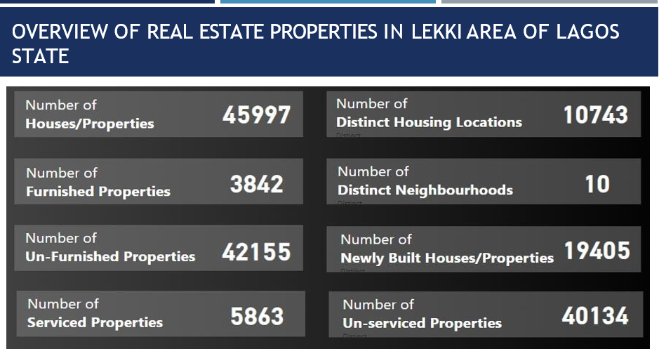
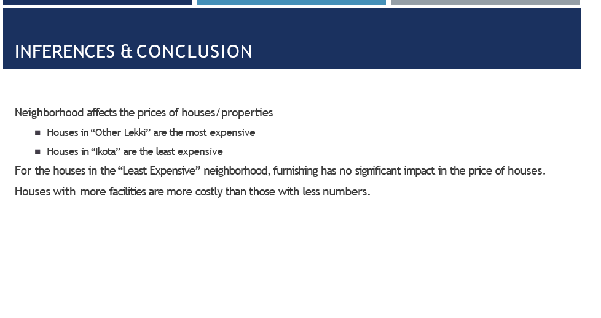

# FCB-group-13-Project
This is a collaborative group work i led during the future clan bootcamp in Data Analysis class. We were given an assignment to gather Dataset for the area of Real Estate, analyze and create a report out of it. After much collation and deliberation, we resolve to working on a Lekki housing data to know the determination of cost of houses there.

## Table of Content

Introduction

Data source

Tool used

Data Transformation and loading

Data Analysis and Visualization

Inference and conclusion

- - -

## Introduction
The aim of this project is to extract valuable insights and trends from data to inform investment decisions, optimize property values, and drive business growth.

## Data Source
The primary source of this project is gotten from Kaggle.com 

## Tools Used
- **Ms Excell** [Download here](https://www.microsoft.com)
- **Power BI** [Download here](https://www.microsoft.com/en-us/power-platform/products/power-bi)

## Data Transformation and Loading
Using the power query editor, we cleaned the data, which means we made sure it was neat and ready to be analyzed.
.

##Data Visualization
With the data in Powe BI dashboard area,we started analyzing it to find amazing patterns and went ahead to create visual charts to further explain them. They will help to have an understanding of what product to get and why, total number of people there and so on. we made use of the slicer tool for comparism sake according to each area.

## Inference and conclusion

    
